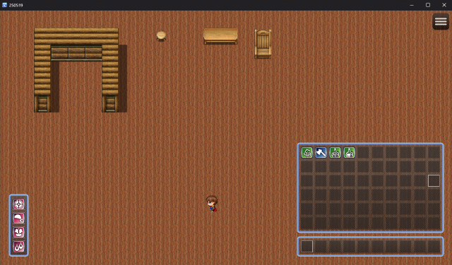

# RSTH RPG Maker MZ Plugins

RPGツクールMZ向けのサバイバル・クラフト・インベントリ・装備UIの統合プラグインセットです。
ただし、まだ作成中のため、正常に動く保証はありません。
現在のところ、このプラグインセットはインベントリ、ホットバーの実装の足掛かり的なものです。
さらに、作成中であるため、アイテムを使用したり防具を装備したりすると、ブラウザのコンソールにログが表示されます。

## 概要

このプラグイン群は以下の3つの主要機能を追加します：

### RSTH_IH.js - インベントリ＋ホットバーUI
- マップ上にインベントリとホットバーを表示
- マウスによるドラッグ＆ドロップに対応
- スタック・アイテム使用・キー操作によるホットバー使用も可能
- カスタムインベントリで内部的に所持アイテムを管理
- (開発中のため、今後アップデートする可能性あり)

### RSTH_EquipmentUI.js - 装備ウィンドウUI(ほぼ完成)
- マップ画面にコンパクトな装備確認ウィンドウを追加
- 装備のダブルクリックで解除し、インベントリやホットバーに戻す処理

### RSTH_Survival.js - ブロック設置＆破壊システム
- アイテム化されたブロックを設置・破壊可能に
- ツール（toolタグ）でのみブロック破壊可
- ブロック破壊時にアイテムがドロップ、近づくと自動回収
- ブロックやドロップ情報はセーブデータに保存される
- (開発中のため、今後アップデートする可能性あり)

## 使用方法

1. "/js/plugins/" に各 ".js" ファイルをコピーしてください
2. プラグインマネージャーで有効化し、RSTH_IH.js → RSTH_EquipmentUI.js → RSTH_Survival.js の順に並べてください
3. 通常の gainItem では動作しません。(今後改善予定)アイテムの追加には以下を使用：

    window.RSTH_IH.gainItemToInventoryThenHotbar($dataItems[2], 10);

## 注意点

- 各プラグインは MIT ライセンスのもとで自由に使用・改変・配布が可能です
- 他のインベントリ系や装備UI系プラグインとは互換性がない場合があります
- アイテムメタタグの定義が必要です
- グローバル汚染防止のため window.RSTH_IH 名前空間を使用

## スクリーンショット

## 動画デモ

[YouTubeで再生](https://www.youtube.com/watch?v=SlF3OF6g5ww)
