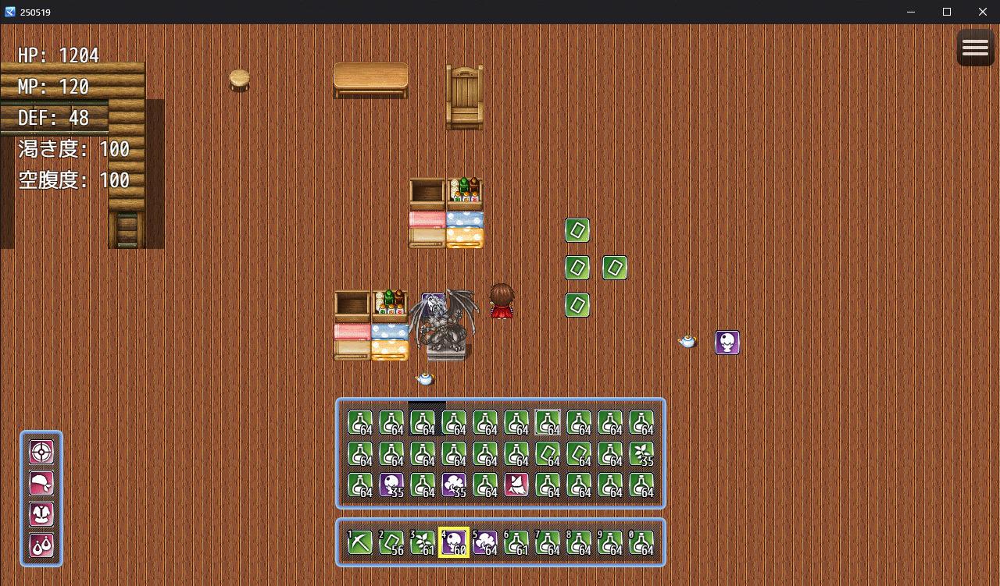

# RSTH RPG Maker MZ Plugins

RPGツクールMZ向けのサバイバル・クラフト・インベントリ・装備UIの統合プラグインセットです。
ただし、まだ作成中のため、正常に動く保証はありません。
現在のところ、このプラグインセットはサバイバルゲームの実装の足掛かり的なものです。

## 概要

このプラグイン群は以下の主要機能を追加します：

 * このプラグインはマップ画面にインベントリとホットバーUIを追加し、
 * プレイヤーの持ち物やショートカットバー（ホットバー）を視覚的に管理できます。
 * マップ上にブロックを設置・破壊できる機能を追加し、
 * ツールによるブロック破壊や、破壊時のドロップ、ドロップアイテムの回収、
 * ドロップの永続保存、通行制御など、サバイバル要素の実装に対応しています。
 *
 * ▼ 主な機能
 * - マウスによるドラッグ＆ドロップでインベントリやホットバー間のアイテム移動が可能
 * - Shiftキー押下によるアイテムの一括移動
 * - ホットバーは数字キー（1～0）、マウスホイール、[]キー（変更可能）でスロットを選択できます。
 * - スタック（所持数の管理。プラグインパラメータで変更可能）対応
 * - マップ表示画面中に右クリックでメニューは開きません。(escキーでメニュー開閉可能)
 * - 左クリックでプレイヤーは移動しません。
 * - WASDキーと矢印キーでプレイヤーを移動できます。（斜め移動も可能）
 * - shiftを押しながら移動するとダッシュできます。（MZ標準機能)
 * - ctrlを押しながら移動すると平行移動ができます。
 * - イベントをマウスオーバーするとマウスポインタが変化します。
 * - 周囲3マス以内にあるイベントを右クリックで会話が可能です。
 * - **マウスポインタの画像はimg/system/にMousePoints.pngを入れてください**
 * - MousePoints.pngは48x48の横2列で作成してください。（つまり縦48横96の画像を2つに分割して使用する)
 * - 
 * - インベントリ、ホットバー内のアイテムをダブルクリックで使用可能（アイテム、防具に対応）
 * - ブロックを設置できるアイテムをホットバーで選択している場合、
 * - 周囲3マス以内の障害物がないマスにブロックを設置できます。
 * - ホットバーで選択されているポーション等のアイテムはマップ画面内で右クリックでも使用可能です。
 * - ホットバーで選択されている武器やツールはマップ画面内でプレイヤー周囲3マス以内で左クリックで使用可能です。
 * - ツール（toolタグ付き武器）で指定ブロックのみ破壊可能
 * - ブロック破壊時にアイテムをドロップ、近づくと自動回収
 * - 配置済みブロックとドロップはセーブデータに保存される
 * - ブロックはタイルID（tileId）で指定、タイルセット画像を使用
 * - ブロックには通行不可になる通行判定制御、
 * - プレイヤーより上層か下層に表示する設定もあります。
 *
 * ▼ 注意事項
 * - 通常の "gainItem" でインベントリ、ホットバーに追加されるようになりました。
 * 
 * - 入手したアイテムはインベントリが満杯になるとホットバーへ格納されます。
 *   ホットバーも満杯の場合にアイテムを入手するとあふれたものは削除されます。
 *   （今後マップにドロップするように改善する予定）
 * 
 * - 使用後のアイテムは自動的に1個減少し、0になればスロットが空になります。
 * - 通常のアイテム所持数と連動せず、内部的に "_customInventoryItems", "_customHotbarItems" に保持されます。
 * 
 * - グローバル汚染を避けるため、window.RSTH_IH 名前空間を使用しています。
 * - ドロップされたアイテムは自動でアイコン表示され、近づくと自動取得されます。
 * - 通行判定をオーバーライドしているため、マップタイルの通行不可と併用注意。
 * 
 * ▼ 使用方法
 * プロジェクトの「js/plugins」フォルダに以下の順で全てのファイルを追加し、
 * プラグインマネージャーから全て有効にしてください。
 * RSTH_IH01_Core.js
 * RSTH_IH02_Util_01.js
 * RSTH_IH02_Util_02.js
 * RSTH_IH02_Util_03.js
 * RSTH_IH03_Gain.js
 * RSTH_IH04_Handle.js
 * RSTH_IH05_Window.js
 * RSTH_IH06_UseItem.js
 * RSTH_IH07_Block_dropitem.js
 * RSTH_IH08_Block_Main.js
 * RSTH_IH09_Block_grow.js
 * RSTH_IH10_SaveLoad.js
 * RSTH_IH11_Debug.js
 * RSTH_IH12_EventHelper.js 
 * 
 * マップ画面で "E" キーを押すとインベントリと装備ウィンドウが開閉します。
 * 
 * ブロックを設置するアイテムのメモ欄には以下のようなメタタグを設定してください：
 *
 * ▼ ブロックアイテムのメタタグ例（通常アイテムとして作成）
 * <block>
 * <tileId:172>
 * <blockName:ドラゴンの石像>
 * <size:[2,2]>
 * <tileset:Inside_C>
 * <tileOffsets1:[
 *   {"dx":0,"dy":0,"tileId":172,"passable":true,"blockZ":"over"},
 *   {"dx":1,"dy":0,"tileId":173,"passable":true,"blockZ":"over"},
 *   {"dx":0,"dy":1,"tileId":188,"passable":false,"blockZ":"under"},
 *   {"dx":1,"dy":1,"tileId":189,"passable":false,"blockZ":"under"}
 * ]>
 * <tileOffsets2:[
 *   {"dx":0,"dy":0,"tileId":181,"passable":true,"blockZ":"under"},
 *   {"dx":1,"dy":0,"tileId":182,"passable":true,"blockZ":"under"},
 *   {"dx":0,"dy":1,"tileId":213,"passable":true,"blockZ":"over"},
 *   {"dx":1,"dy":1,"tileId":214,"passable":true,"blockZ":"over"}
 * ]>
 * <growthTime:200>
 * <dropItems1:itemId:4,amount:1>
 * <dropItems2:itemId:4,amount:3>
 * 以上がメモ欄へ記載するメタタグ。
 * tileIdはタイルセットのcols（1行に何個タイルがあるか）に影響されます。
 * colsが16の場合、1行目はtileId:1で、2行目はtileId:17となります。
 * colsはプラグインパラメータで変更が可能です。
 * 
 * <tileOffsets1:>と<tileOffsets2:>は成長前と成長後に
 * どのマスにどのtileIdを表示するかの指定、
 * passableはtrueで通行可能、falseで通行不可能の指定が可能です。
 * blockZはunderでプレイヤーより下層、overでプレイヤーより上層に
 * 表示されるようになります。
 * 
 * growthTimeはブロックが成長するまでの時間で、
 * 0の場合は成長しない普通のブロックとなります。
 * dropItems1は成長前、dropItems2は成長後に
 * ブロックを破壊すると落とすアイテムを指定できます。
 * 各タイルセットのtileIdを知りたい場合は、別ファイルの
 * TileID計算ツール.htmlを使うと楽になるかもしれません。
 * 
 * ▼ ツール（武器）のメタタグ例（tool指定と破壊対象のtileId）
 * （今後、ブロック種別などの実装予定）
 * <tool>
 * <blockEffective:[1,2,3]>
 *
 * ▼ 使用例：スクリプトからブロックを設置・破壊
 * window.RSTH_IH.SurvivalBlockManager.place(x, y, itemId)
 * window.RSTH_IH.SurvivalBlockManager.break(x, y)
 * window.RSTH_IH.SurvivalBlockManager.get(x, y)
 *
 * ▼ ライセンス
 * このプラグインは MITライセンス の下で公開されています。
 * 
 * ----------------------------
 * 変更履歴:
 * ----------------------------
 * 
 * Ver.1.0.8 - 2025/06/03
 *     色々な機能を追加。
 *     RSTH_IH、RSTH_Survivalなどを統合し、ファイルを分割した。
 * 
 * Ver.1.0.7 - 2025/05/31
 *     RSTH_Survival.jsに合わせて内容を修正。
 * 
 * Ver.1.0.6 - 2025/05/29
 *     インベントリ、ホットバーのprocessTouch()関連の処理を修正。
 *     ブロック設置前の判定を強化。
 * 
 * Ver.1.0.5 - 2025/05/27
 *     インベントリ、ホットバーがメッセージウィンドウより下に表示されるように修正。
 * 
 * Ver.1.0.4 - 2025/05/27
 *   - アイテムを二重に使用するバグを修正。
 *     武器をダブルクリック、数字キー押下で装備できるように修正
 *     武器を装備するシステム自体をありにするか、なしにするかを
 *     プラグインパラメータで設定できるように修正
 * 
 * Ver.1.0.3 - 2025/05/27
 *   - インベントリ満杯、ホットバーに空きスロットが1つ、 他スロットに防具2が存在し、
 *     防具1を装備している状態で、防具2があるスロットに対応する数字キーを押下後、
 *     防具2が装備されるが、外された防具1がホットバーに格納されないバグを修正。
 *     RSTH_DEBUG_LOG がtrueの場合のみこのファイルのコンソールログを出力するように修正
 * 
 * Ver.1.0.2 - 2025/05/26
 *   - インベントリとホットバーが満杯の時、メニューの装備から装備を外せないように修正
 * 
 * Ver.1.0.1 - 2025/05/26
 *   - 通常イベントのアイテム入手処理からインベントリ、ホットバーに格納できるように修正
 * 
 * Ver.1.0.0 - 2025/05/25
 *   - 初版公開

## スクリーンショット

## 動画デモ

[YouTubeで再生](https://www.youtube.com/watch?v=SlF3OF6g5ww)
